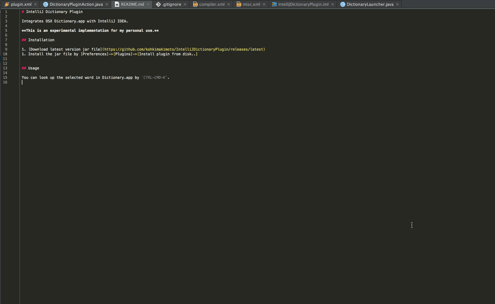

# IntelliJ Dictionary Plugin

Integrates OSX Dictionary.app with IntelliJ IDEA.

**This is an experimental implementation for my personal use.**

## Installation

1. [Download latest version jar file](https://github.com/kohkimakimoto/IntelliJDictionaryPlugin/releases/latest)
1. Install the jar file by [Preferences]->[Plugins]->[Install plugin from disk..]

## Usage

You can look up the selected word in Dictionary.app by `CTRL-CMD-K`.

## Author

Kohki Makimoto <kohki.makimoto@gmail.com>

## License

MIT license.
